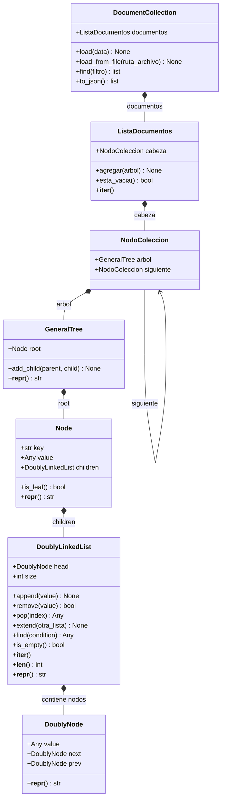

# Diagrama de Clases

## Diagrama UML



---

## Descripción de las relaciones

| Relación | Tipo | Descripción |
|----------|------|-------------|
| `DoublyLinkedList` → `DoublyNode` | Composición `*--` | La lista contiene y gestiona sus propios nodos |
| `Node` → `DoublyLinkedList` | Composición `*--` | Cada nodo del árbol tiene su propia lista de hijos |
| `GeneralTree` → `Node` | Composición `*--` | El árbol contiene y es dueño de su raíz |
| `NodoColeccion` → `GeneralTree` | Composición `*--` | Cada eslabón de la colección contiene un árbol |
| `NodoColeccion` → `NodoColeccion` | Asociación `-->` | Auto-referencia: el puntero `siguiente` al próximo eslabón |
| `ListaDocumentos` → `NodoColeccion` | Composición `*--` | La lista gestiona sus eslabones de documentos |
| `DocumentCollection` → `ListaDocumentos` | Composición `*--` | La colección contiene y gestiona la lista de documentos |

---

## Flujo entre clases (de abajo hacia arriba)

```
DoublyNode          ← eslabón base, usado por DoublyLinkedList
    ↑
DoublyLinkedList    ← lista doble, usada como children en Node
    ↑
Node                ← nodo del árbol, tiene key, value y children
    ↑
GeneralTree         ← árbol completo, tiene un Node raíz
    ↑
NodoColeccion       ← eslabón de la colección, contiene un GeneralTree
    ↑
ListaDocumentos     ← cadena de NodoColeccion  →  →  → None
    ↑
DocumentCollection  ← clase principal que usa todo lo anterior
```

---

## Dónde vive cada clase

| Clase | Archivo |
|-------|---------|
| `DoublyNode` | `motor/estructuras.py` |
| `DoublyLinkedList` | `motor/estructuras.py` |
| `Node` | `motor/estructuras.py` |
| `GeneralTree` | `motor/estructuras.py` |
| `NodoColeccion` | `motor/lista_documentos.py` |
| `ListaDocumentos` | `motor/lista_documentos.py` |
| `DocumentCollection` | `motor/coleccion.py` |
